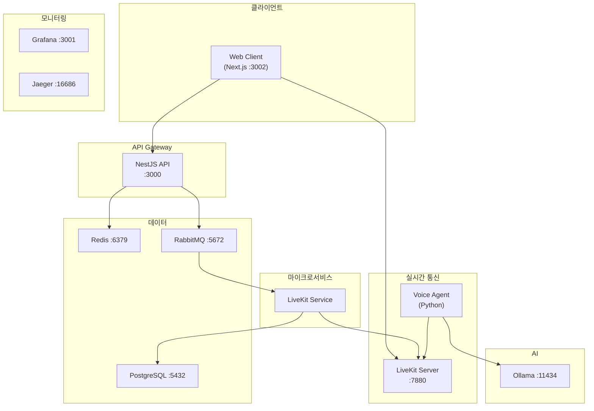
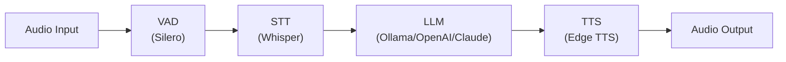

# LiveKit MSA Server

NestJS 기반 LiveKit 연동 MSA 서버 - 실시간 음성 AI 에이전트 플랫폼

## 아키텍처



## 프로젝트 구조

```
livekit-msa-server/
├── apps/
│   ├── api-gateway/          # REST API 게이트웨이 (HTTP → RabbitMQ)
│   ├── livekit-service/      # LiveKit SDK 연동 마이크로서비스
│   ├── room-service/         # Room 관리 마이크로서비스 (DB + LiveKit)
│   ├── voice-agent/          # Python Voice AI Agent (STT/LLM/TTS)
│   └── web-client/           # Next.js 웹 클라이언트
├── libs/
│   ├── core/                 # 공통 설정 (Config, Logger)
│   ├── shared/               # 공유 DTO, 인터페이스, 상수
│   ├── rabbitmq/             # RabbitMQ 모듈 및 RPC 헬퍼
│   ├── prisma/               # Prisma 데이터베이스 모듈
│   ├── redis/                # Redis 캐시/세션 모듈
│   ├── livekit/              # LiveKit SDK 래퍼 모듈
│   ├── llm/                  # Multi-provider LLM 모듈
│   └── telemetry/            # OpenTelemetry 모듈
├── docs/                     # 문서
│   ├── architecture.md       # 시스템 구조도
│   └── livekit-guide.md      # LiveKit 통합 가이드
└── prisma/
    └── schema.prisma         # 데이터베이스 스키마
```

## 요구사항

- Node.js >= 22
- Docker & Docker Compose
- npm

## 빠른 시작

### 1. 환경 설정

```bash
# 저장소 클론
git clone https://github.com/jaystevency/livekit-msa-server.git
cd livekit-msa-server

# 의존성 설치
npm install

# Prisma 클라이언트 생성
npm run prisma:generate

# 환경 변수 설정
cp docker.env.example docker.env
```

### 2. Docker로 실행

```bash
# 모든 서비스 시작
npm run docker:up
# 또는
docker compose up -d

# 로그 확인
npm run docker:logs
# 또는
docker compose logs -f

# 서비스 중지
npm run docker:down
# 또는
docker compose down

# 특정 서비스만 재시작
docker compose restart voice-agent
docker compose restart api-gateway

# 서비스 재빌드 후 시작
docker compose up -d --build

# 특정 서비스만 빌드
docker compose build voice-agent
docker compose build api-gateway
```

### 3. 접속

| 서비스 | URL |
|--------|-----|
| Web Client | http://localhost:3002 |
| API Gateway | http://localhost:3000 |
| Swagger 문서 | http://localhost:3000/api |
| Grafana | http://localhost:3001 |
| Jaeger | http://localhost:16686 |
| RabbitMQ UI | http://localhost:15672 |

## 로컬 개발

```bash
# API Gateway
npm run start:api-gateway:dev

# LiveKit Service
npm run start:livekit-service:dev

# Room Service
npm run start:room-service:dev
```

## 환경 변수

`docker.env` 파일 설정:

```env
# Environment
NODE_ENV=development

# LiveKit
LIVEKIT_API_KEY=devkey
LIVEKIT_API_SECRET=secret
LIVEKIT_WS_URL=ws://livekit:7880

# LLM Provider (ollama, openai, claude, gemini)
LLM_PROVIDER=ollama
OLLAMA_BASE_URL=http://ollama:11434
OLLAMA_MODEL=llama3.2

# OpenAI (선택)
OPENAI_API_KEY=sk-...
OPENAI_MODEL=gpt-4

# Claude (선택)
ANTHROPIC_API_KEY=sk-ant-...
CLAUDE_MODEL=claude-3-sonnet-20240229

# Voice Agent
WHISPER_MODEL_SIZE=base
TTS_VOICE=ko-KR-SunHiNeural

# Telemetry
OTEL_ENABLED=true
OTEL_EXPORTER_OTLP_ENDPOINT=http://jaeger:4318/v1/traces
```

## API 엔드포인트

### Rooms

| Method | Endpoint | Description |
|--------|----------|-------------|
| POST | `/rooms` | 새 방 생성 |
| GET | `/rooms` | 모든 방 조회 |
| GET | `/rooms/:name` | 특정 방 조회 |
| DELETE | `/rooms/:name` | 방 삭제 |
| POST | `/rooms/:name/join` | 방 입장 (토큰 발급) |
| GET | `/rooms/:name/participants` | 참가자 목록 |
| DELETE | `/rooms/:name/participants/:identity` | 참가자 강제 퇴장 |
| POST | `/rooms/:name/participants/:identity/mute` | 참가자 음소거 |

### Chat

| Method | Endpoint | Description |
|--------|----------|-------------|
| POST | `/chat` | LLM 채팅 요청 |

### Health

| Method | Endpoint | Description |
|--------|----------|-------------|
| GET | `/health` | 헬스 체크 |
| GET | `/health/liveness` | Liveness probe |
| GET | `/health/readiness` | Readiness probe |

## 서비스 포트

| Service | Port | Description |
|---------|------|-------------|
| Web Client | 3002 | Next.js 웹 클라이언트 |
| API Gateway | 3000 | REST API 엔드포인트 |
| LiveKit Server | 7880, 7881, 7882/udp | WebRTC SFU |
| PostgreSQL | 5432 | 데이터베이스 |
| Redis | 6379 | 캐시/세션 |
| RabbitMQ | 5672, 15672 | 메시지 브로커 |
| Ollama | 11434 | 로컬 LLM |
| Grafana | 3001 | 모니터링 대시보드 |
| Jaeger | 16686 | 분산 트레이싱 |
| Loki | 3100 | 로그 수집 |

## Voice Agent

Python 기반 음성 AI 에이전트:



**지원 LLM:**
- Ollama (기본) - llama3.2, gemma2, mistral
- OpenAI - gpt-4, gpt-3.5-turbo
- Claude - claude-3-opus, claude-3-sonnet
- Gemini - gemini-pro, gemini-flash

## 기술 스택

| Category | Technology |
|----------|------------|
| **Backend Framework** | NestJS 11 |
| **Database** | PostgreSQL + Prisma |
| **Cache** | Redis |
| **Message Broker** | RabbitMQ |
| **WebRTC** | LiveKit |
| **Voice AI** | Whisper (STT), Edge TTS, Silero VAD |
| **LLM** | Ollama, OpenAI, Claude, Gemini |
| **Frontend** | Next.js 15, Tailwind CSS |
| **Observability** | OpenTelemetry, Jaeger, Loki, Grafana |
| **Logging** | Pino |
| **CI/CD** | GitHub Actions, semantic-release |

## 문서

- [시스템 구조도](docs/architecture.md)
- [LiveKit 통합 가이드](docs/livekit-guide.md)

## 개발 가이드

### 커밋 컨벤션

[Conventional Commits](https://www.conventionalcommits.org/) 사용:

```bash
# 커밋 도구 사용
npm run commit

# 또는 직접 작성
git commit -m "feat: 새로운 기능 추가"
git commit -m "fix: 버그 수정"
git commit -m "docs: 문서 업데이트"
```

### 자동 릴리스

`master` 브랜치에 푸시하면 semantic-release가 자동으로:
- 버전 결정 (feat→minor, fix→patch)
- CHANGELOG.md 생성
- GitHub Release 생성

## 라이선스

UNLICENSED
