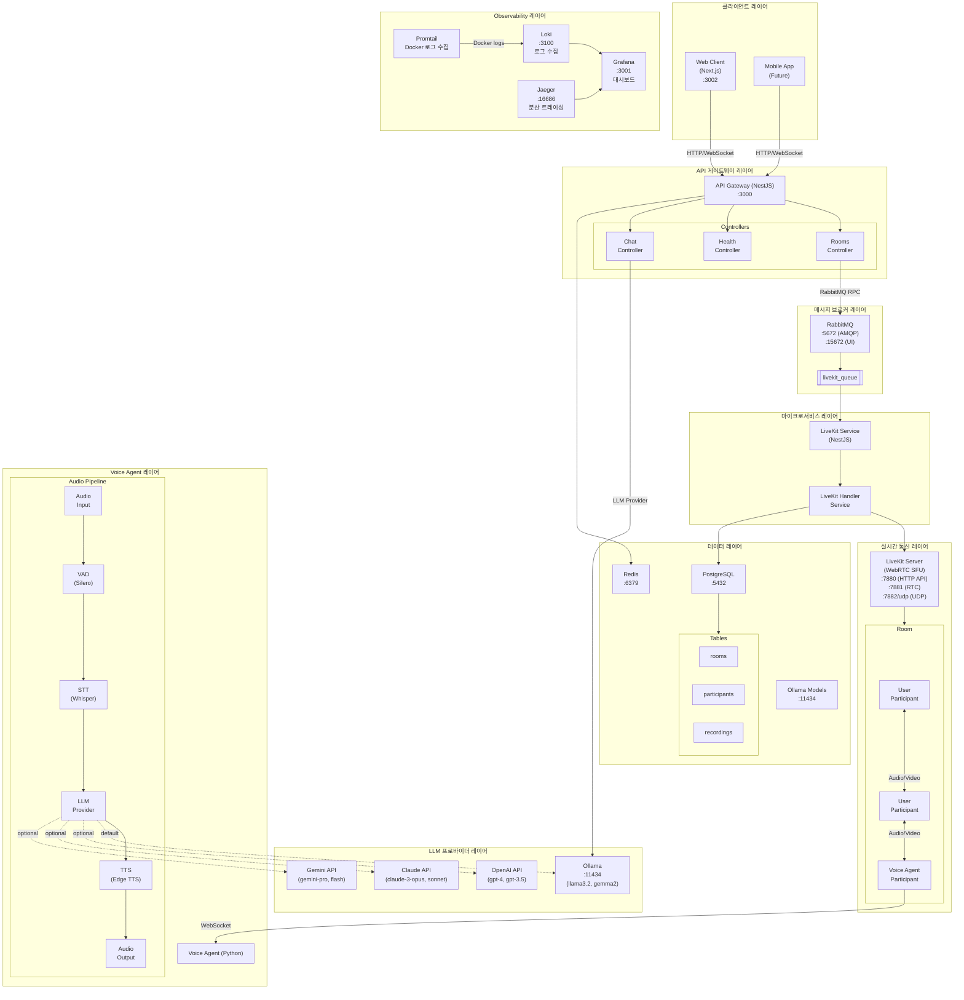
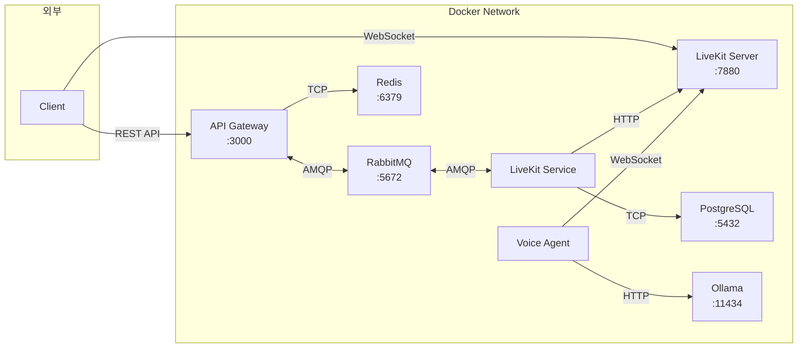
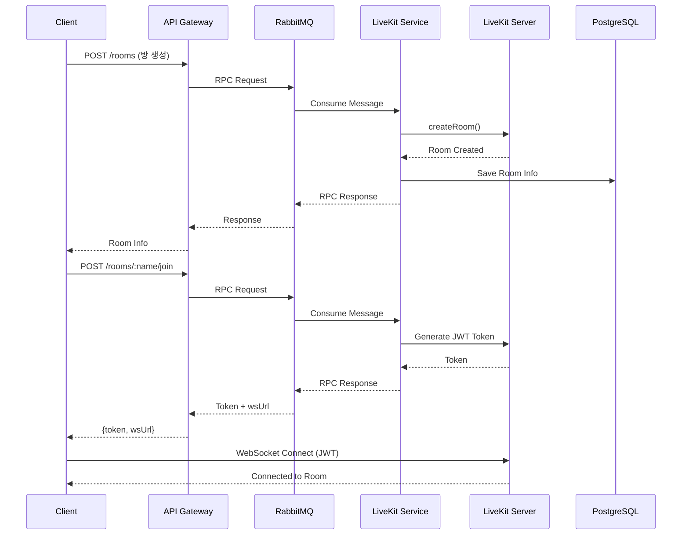
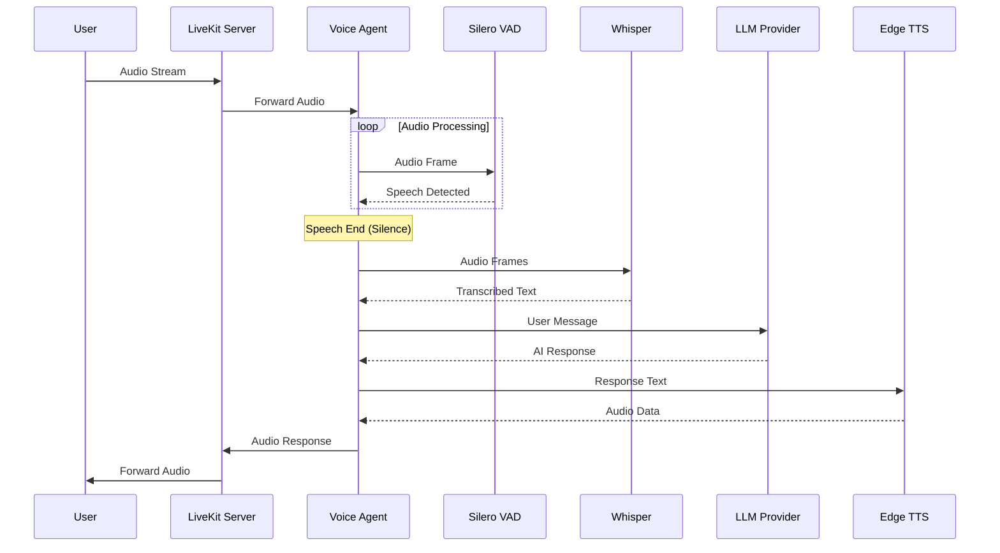
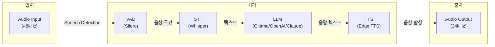
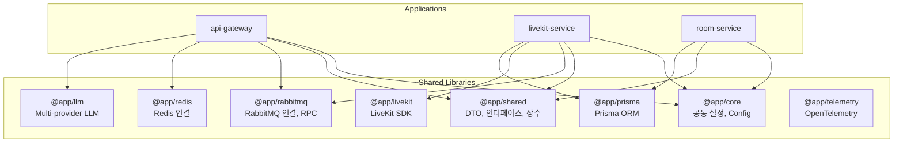

# LiveKit MSA Server - 시스템 구조도

## 전체 아키텍처



## 서비스 연결 상세



## 데이터 흐름

### 1. 방 생성 및 입장 플로우



### 2. Voice Agent 대화 플로우



### 3. Voice Agent 오디오 파이프라인



## 공유 라이브러리 (libs/)



## 포트 정보

| 서비스 | 포트 | 설명 |
|--------|------|------|
| API Gateway | 3000 | REST API 엔드포인트 |
| Web Client | 3002 | Next.js 웹 클라이언트 |
| LiveKit Server | 7880, 7881, 7882/udp | WebRTC SFU |
| PostgreSQL | 5432 | 데이터베이스 |
| Redis | 6379 | 캐시/세션 |
| RabbitMQ | 5672, 15672 | 메시지 브로커 |
| Ollama | 11434 | 로컬 LLM |
| Grafana | 3001 | 모니터링 대시보드 |
| Jaeger | 16686 | 분산 트레이싱 UI |
| Loki | 3100 | 로그 수집 |

## 환경 변수

### LLM Provider 설정

```env
# LLM Provider 선택 (ollama, openai, claude, gemini)
LLM_PROVIDER=ollama

# Ollama
OLLAMA_BASE_URL=http://ollama:11434
OLLAMA_MODEL=llama3.2

# OpenAI
OPENAI_API_KEY=sk-...
OPENAI_MODEL=gpt-4

# Claude
ANTHROPIC_API_KEY=sk-ant-...
CLAUDE_MODEL=claude-3-sonnet-20240229

# Gemini
GOOGLE_API_KEY=...
GEMINI_MODEL=gemini-pro
```

### Voice Agent 설정

```env
# Whisper STT
WHISPER_MODEL_SIZE=base
WHISPER_DEVICE=cpu
WHISPER_COMPUTE_TYPE=int8

# TTS
TTS_VOICE=ko-KR-SunHiNeural

# Turn Detection
TURN_DETECTION_SILENCE_MS=800
TURN_DETECTION_MIN_SPEECH_MS=300
```
