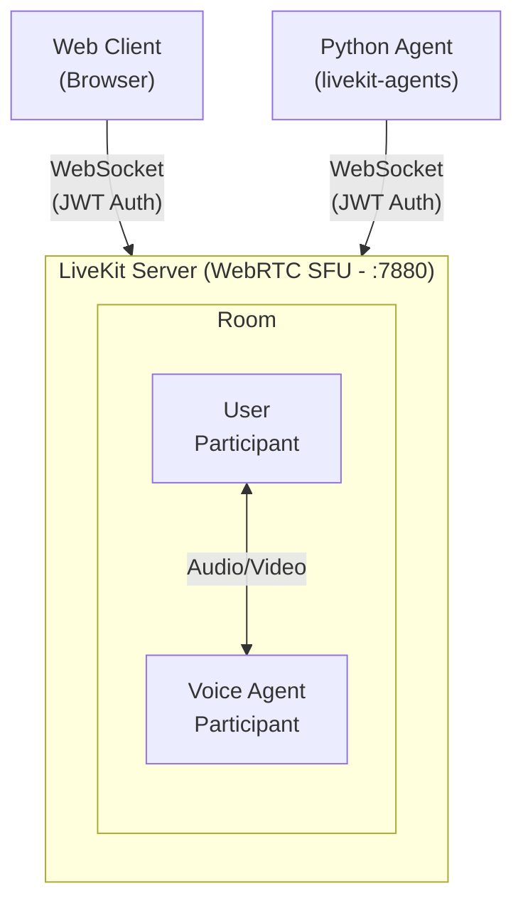
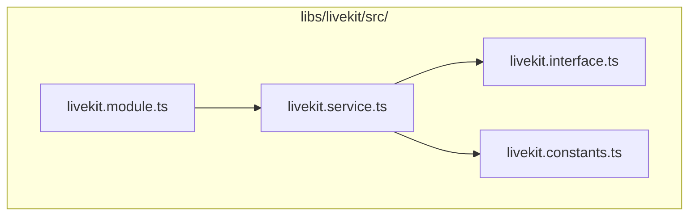
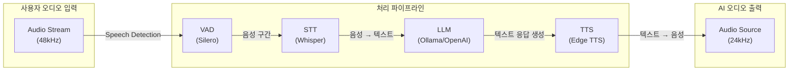
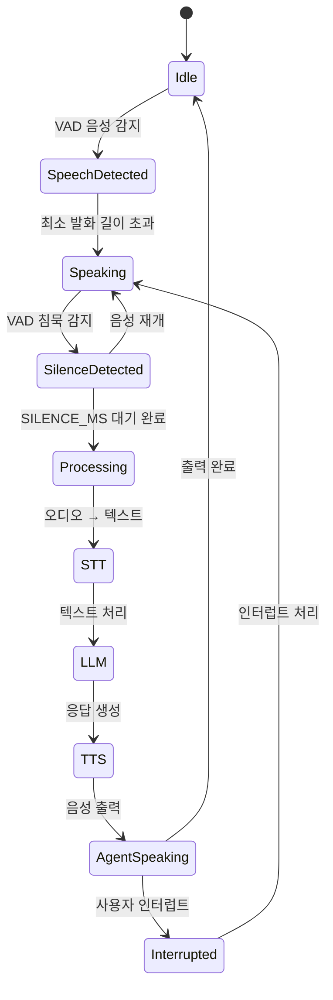
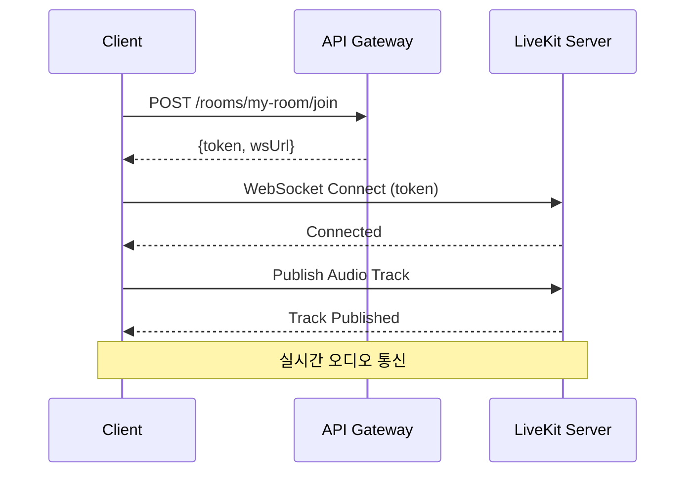
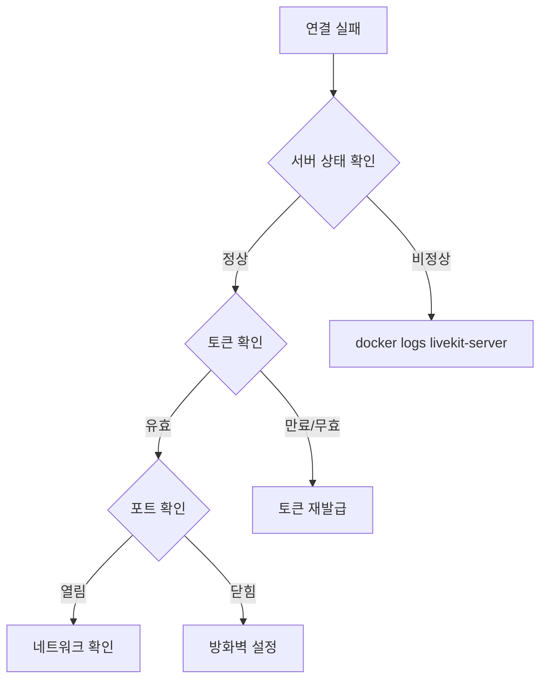

# LiveKit 통합 가이드

## 개요

LiveKit은 WebRTC 기반의 실시간 오디오/비디오 통신 플랫폼입니다. 이 프로젝트에서는 LiveKit을 사용하여 Voice Agent와 사용자 간의 실시간 음성 대화를 구현합니다.

## 아키텍처



## LiveKit Server 설정

### livekit.yaml 설정 파일

```yaml
port: 7880
rtc:
  port_range_start: 50000
  port_range_end: 60000
  tcp_port: 7881
  use_external_ip: false
  node_ip: 127.0.0.1

keys:
  devkey: secret          # API Key: Secret 쌍

logging:
  level: info
  json: false

room:
  empty_timeout: 300      # 빈 방 자동 삭제 (초)
  max_participants: 100   # 방당 최대 참가자

redis:
  address: redis:6379     # Redis 연결 (클러스터링용)

webhook:
  api_key: devkey         # Webhook 인증
```

### 포트 구성

| 포트 | 프로토콜 | 용도 |
|------|----------|------|
| 7880 | HTTP/WS | REST API 및 WebSocket 시그널링 |
| 7881 | TCP | RTC TCP 연결 (방화벽 환경) |
| 50000-60000 | UDP | WebRTC 미디어 스트림 |

## NestJS LiveKit 모듈

### 모듈 구조



### LivekitService 메서드

| 메서드 | 설명 | 반환 타입 |
|--------|------|-----------|
| `createToken(options)` | 참가자 접근 토큰 생성 | `Promise<string>` |
| `createRoom(name, emptyTimeout?, maxParticipants?, metadata?)` | 새 방 생성 | `Promise<Room>` |
| `listRooms(names?)` | 방 목록 조회 | `Promise<Room[]>` |
| `getRoom(name)` | 특정 방 조회 | `Promise<Room \| null>` |
| `deleteRoom(name)` | 방 삭제 | `Promise<void>` |
| `listParticipants(roomName)` | 참가자 목록 조회 | `Promise<ParticipantInfo[]>` |
| `getParticipant(roomName, identity)` | 특정 참가자 조회 | `Promise<ParticipantInfo \| null>` |
| `removeParticipant(roomName, identity)` | 참가자 강제 퇴장 | `Promise<void>` |
| `muteParticipant(roomName, identity, trackSource, muted)` | 참가자 음소거 | `Promise<void>` |
| `updateParticipant(roomName, identity, metadata?, name?)` | 참가자 정보 업데이트 | `Promise<ParticipantInfo>` |
| `updateRoomMetadata(roomName, metadata)` | 방 메타데이터 업데이트 | `Promise<Room>` |
| `getWsUrl()` | WebSocket URL 반환 | `string` |

### 토큰 생성 옵션

```typescript
interface CreateTokenOptions {
  roomName: string;      // 방 이름
  identity: string;      // 참가자 고유 ID
  name?: string;         // 표시 이름
  metadata?: string;     // 커스텀 메타데이터 (JSON)
  canPublish?: boolean;  // 오디오/비디오 발행 권한 (기본: true)
  canSubscribe?: boolean; // 트랙 구독 권한 (기본: true)
  canPublishData?: boolean; // 데이터 채널 발행 권한 (기본: true)
  ttl?: number;          // 토큰 유효시간 (초, 기본: 3600)
}
```

## REST API 엔드포인트

### Rooms API

| Method | Endpoint | 설명 |
|--------|----------|------|
| `POST` | `/rooms` | 새 방 생성 |
| `GET` | `/rooms` | 모든 방 조회 |
| `GET` | `/rooms/:name` | 특정 방 조회 |
| `DELETE` | `/rooms/:name` | 방 삭제 |
| `POST` | `/rooms/:name/join` | 방 입장 (토큰 발급) |
| `GET` | `/rooms/:name/participants` | 참가자 목록 |
| `DELETE` | `/rooms/:name/participants/:identity` | 참가자 강제 퇴장 |
| `POST` | `/rooms/:name/participants/:identity/mute` | 참가자 음소거 |

### 방 생성 요청 예시

```bash
curl -X POST http://localhost:3000/rooms \
  -H "Content-Type: application/json" \
  -d '{
    "name": "my-room",
    "emptyTimeout": 300,
    "maxParticipants": 10,
    "metadata": "{\"type\": \"voice-chat\"}"
  }'
```

### 방 입장 요청 예시

```bash
curl -X POST http://localhost:3000/rooms/my-room/join \
  -H "Content-Type: application/json" \
  -d '{
    "identity": "user-123",
    "name": "홍길동",
    "canPublish": true,
    "canSubscribe": true
  }'
```

**응답:**
```json
{
  "token": "eyJhbGciOiJIUzI1NiIsInR5cCI6IkpXVCJ9...",
  "wsUrl": "ws://localhost:7880"
}
```

## Voice Agent 통합

### Python Agent 구조

Voice Agent는 `livekit-agents` SDK를 사용하여 LiveKit 방에 참가합니다.

```python
from livekit import rtc
from livekit.agents import JobContext, AutoSubscribe, cli

async def entrypoint(ctx: JobContext):
    # 방 연결 (오디오만 구독)
    await ctx.connect(auto_subscribe=AutoSubscribe.AUDIO_ONLY)

    # TTS 출력용 오디오 트랙 생성
    audio_source = rtc.AudioSource(24000, 1)  # 24kHz mono
    track = rtc.LocalAudioTrack.create_audio_track("agent-voice", audio_source)

    # 트랙 발행
    options = rtc.TrackPublishOptions()
    options.source = rtc.TrackSource.SOURCE_MICROPHONE
    await ctx.room.local_participant.publish_track(track, options)

    # 참가자 오디오 트랙 구독 이벤트
    @ctx.room.on("track_subscribed")
    def on_track_subscribed(track, publication, participant):
        if track.kind == rtc.TrackKind.KIND_AUDIO:
            # 오디오 처리 시작
            asyncio.create_task(handle_audio(track, participant))
```

### 오디오 파이프라인



### Turn Detection (발화 차례 감지)



**설정 값:**
```python
TURN_DETECTION_SILENCE_MS = 800     # 침묵 후 턴 종료 (ms)
TURN_DETECTION_MIN_SPEECH_MS = 300  # 최소 발화 길이 (ms)
TURN_DETECTION_PREFIX_PADDING_MS = 300  # 발화 시작 전 포함 (ms)
INTERRUPT_THRESHOLD_MS = 500        # 인터럽트 감지 임계값 (ms)
```

**Turn Detection 흐름:**

1. VAD가 음성 시작 감지 → `start_speech()`
2. 음성 프레임 버퍼에 수집
3. VAD가 침묵 감지 → `end_speech()`
4. `TURN_DETECTION_SILENCE_MS` 대기
5. 최소 발화 길이 확인 → STT/LLM/TTS 처리
6. 인터럽트 감지 시 AI 응답 중단

## 클라이언트 연결

### 연결 흐름



### JavaScript/TypeScript 클라이언트

```typescript
import { Room, RoomEvent, Track } from 'livekit-client';

// 방 생성 및 토큰 획득
const response = await fetch('/rooms/my-room/join', {
  method: 'POST',
  headers: { 'Content-Type': 'application/json' },
  body: JSON.stringify({ identity: 'user-123', name: '사용자' })
});
const { token, wsUrl } = await response.json();

// 방 연결
const room = new Room();
await room.connect(wsUrl, token);

// 오디오 트랙 발행
const localTrack = await room.localParticipant.setMicrophoneEnabled(true);

// 원격 트랙 구독
room.on(RoomEvent.TrackSubscribed, (track, publication, participant) => {
  if (track.kind === Track.Kind.Audio) {
    const audioElement = track.attach();
    document.body.appendChild(audioElement);
  }
});
```

### React 컴포넌트 예시

```tsx
import { LiveKitRoom, AudioTrack, useParticipants } from '@livekit/components-react';

function VoiceRoom({ token, wsUrl }) {
  return (
    <LiveKitRoom
      token={token}
      serverUrl={wsUrl}
      connect={true}
      audio={true}
      video={false}
    >
      <AudioRenderer />
    </LiveKitRoom>
  );
}

function AudioRenderer() {
  const participants = useParticipants();

  return (
    <>
      {participants.map((p) => (
        <AudioTrack key={p.sid} participant={p} />
      ))}
    </>
  );
}
```

## 환경 변수

```env
# LiveKit Server
LIVEKIT_API_KEY=devkey
LIVEKIT_API_SECRET=secret
LIVEKIT_WS_URL=ws://localhost:7880

# Voice Agent
LIVEKIT_URL=ws://livekit:7880  # Docker 내부 연결
```

## 트러블슈팅

### 연결 실패



1. LiveKit 서버 상태 확인:
   ```bash
   docker logs livekit-server
   ```

2. 포트 확인:
   ```bash
   curl http://localhost:7880
   ```

3. 토큰 유효성 확인 (JWT 디코딩):
   ```bash
   # jwt.io에서 토큰 디코딩
   ```

### 오디오 문제

1. 브라우저 마이크 권한 확인
2. 오디오 트랙 발행 여부 확인:
   ```javascript
   console.log(room.localParticipant.audioTracks);
   ```
3. 원격 트랙 구독 상태 확인:
   ```javascript
   room.remoteParticipants.forEach(p => {
     console.log(p.identity, p.audioTracks);
   });
   ```

### Voice Agent 디버깅

```bash
# Voice Agent 로그 확인
docker logs -f livekit-voice-agent

# 메트릭 로그 필터링
docker logs livekit-voice-agent 2>&1 | grep "METRIC"
```

## 참고 자료

- [LiveKit 공식 문서](https://docs.livekit.io/)
- [LiveKit Server SDK](https://github.com/livekit/server-sdk-js)
- [LiveKit Client SDK](https://github.com/livekit/client-sdk-js)
- [LiveKit Agents](https://github.com/livekit/agents)
